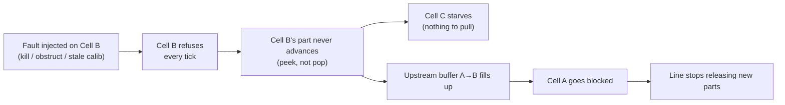

# A Runtime for a Mixed Fleet of Arms

Software that runs manipulation work across a fleet of MuJoCo-simulated
factory cells that aren't identical, and keeps the line moving when
individual cells can't do the work in front of them. See
[DESIGN.md](DESIGN.md) for the design note and per-phase writeup, and
[TODO.md](TODO.md) for known gaps and backlog.

Current state: Phases 1 and 2 complete; Phase 3 (Line, buffers, takt
clock, fault injection) built and runnable, dashboard and the
third-hardware extension diff not yet done — see DESIGN.md section 7.

## Setup

```bash
python3 -m venv .venv
source .venv/bin/activate
pip install -r requirements.txt
```

First run of anything that loads `panda_mj_description` /
`ur5e_mj_description` clones the model repos (~1 min, one-time).

## Run the tests

```bash
python -m pytest runtime/ -q
```

## Run things

**One cell, one cycle** — sanity check against a real Panda model:

```bash
python -m runtime.demo
```

**Every refusal/failure class, back to back** — the phase-2 "an example
of each refusal" deliverable, run against real `Cell`/`Line` objects
(not mocks), with assertions and printed commentary at each step:

```bash
python -m runtime.fault_tour_demo
```

**A live shift** — two cells (Panda + UR5e) running on a real takt
clock, printing per-tick state (running / starved / blocked / refused /
over-takt) and buffer occupancy:

```bash
python -m runtime.line_runner --ticks 20        # bounded
python -m runtime.line_runner                    # runs until Ctrl-C
python -m runtime.line_runner --interval 1.0     # faster ticks
```

While it's running, drive faults and overrides from a second terminal:

```bash
# adversarial per-cycle target (stays active until cleared/replaced)
echo '{"target_qpos": [9, 9, 9, 9, 9, 9, 9]}' > task_input/task_cell_panda_001.json

# commands, consumed once read
touch commands/obstruct_cell_panda_001.json        # inject an obstruction (halts until cleared)
touch commands/kill_cell_panda_001.json             # kill mid-cycle (halts until cleared)
touch commands/drop_clear_cell_panda_001.json       # part dropped OUTSIDE the workspace (one-shot failure, no halt)
touch commands/clear_failure_cell_panda_001.json    # unhalt, drop active instruction
```

Watch a stuck cell stall the line: its own part stops advancing, its
downstream neighbor finishes what it already had and then reads
STARVED, and once the stuck cell's upstream buffer fills, the Line
stops releasing new parts entirely.



## Look at a resolved config

Prints one cell's config with, per field, which layer (fleet default /
site override / per-unit correction) set it — the phase-2 "resolved
config for one cell showing where each value came from" deliverable:

```bash
python -c "
from runtime import config
import json
print(json.dumps(config.resolve('cell_panda_001', site_id='site_a'), indent=2))
"
```

## Look at records

Every cycle (success, failure, or refusal) is written to
`records/{cell_id}/{cycle_id}.json`; `line_runner.py` also links each
shift's cycles into `records/runs/{run_id}/` in tick order, so a whole
shift reads as one directory listing:

```bash
ls records/runs/
cat records/runs/<run_id>/tick_0001_cell_panda_001_*.json
```

Look up the resolved config a specific record ran under (stored by
hash, not duplicated per record):

```bash
python -m runtime.records records/cell_panda_001/<cycle_id>.json
```

## Layout

```
runtime/        orchestration code (Cell, Line, Config, Controller, records, ...)
config/         fleet_defaults.yaml, site_overrides/, per_unit/, line_defaults.yaml
task_input/     per-cycle instruction override inbox (file-polled)
commands/       fault-injection / clear-failure commands (file-polled)
records/        cycle records, config snapshots, per-shift run indexes
DESIGN.md       design note + per-phase writeup
TODO.md         known gaps and backlog
```
